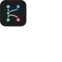

<p align="center">
  
</p>

<h1 align="center">BetterGitGraph</h1>

<p align="center">
  <strong>A modern, high-performance, node-based Git visualization & management extension for Visual Studio Code.</strong>
</p>

<p align="center">
  <a href="https://github.com/Renoceros/bettergitgraph/releases/latest"></a>
  <a href="https://marketplace.visualstudio.com/items?itemName=Renoceros.bettergitgraph"></a>
  <a href="https://github.com/Renoceros/bettergitgraph/actions"></a>
  <a href="LICENSE"></a>
  
</p>

---

## 🌟 Overview

Most Git graph extensions render commit history as rigid, tabular text logs with unpredictable, flickering branch colors that change between sessions. 

**BetterGitGraph** redesigns Git visualization from the ground up for **clarity, speed, and safety**:
- Commits are rendered as **fluid interactive topological nodes** with smooth Bézier curve routing on a hardware-accelerated canvas.
- Branch colors are **deterministic and persistent** across all sessions and machines.
- The `main`/`master` branch is visually established as a **solid, unbroken central trunk**, while feature branches branch out as vines and reattach upon merging.
- Safe Git operations (Checkout, Branch, Tag, Revert, Cherry-Pick, Reset) are one click away, backed by **plain-English beginner explanations** and **destructive-action guardrails**.

---

## ✨ Key Features

### 1. ⏱️ Dual Visualization Engines & 4-Direction Matrix
Switch seamlessly between two purpose-built visualization paradigms across 4 flow orientations (`↓ TB`, `↑ BT`, `→ LR`, `← RL`):
- **Timeline View (Default):** Commits are ordered strictly chronologically descending (newest at the top, oldest at the bottom). Ideal for understanding the exact sequence of real-time developments across all branches.
- **Tree View (Topological DAG):** Commits are structured topologically based on parent-child ancestry relationships using Sugiyama layout algorithms. Ideal for inspecting complex feature branches, merges, and octopus merges.

### 2. 🌲 The Trunk & Vine Visual Hierarchy
- **The Central Trunk:** `main` (or `master`) is visually anchored as the repository's continuous central spine with a prominent, thicker stroke ($5.0\text{px}$).
- **Feature Vines:** Feature and bugfix branches fork outward into parallel lanes ($2.5\text{px}$) and curve gracefully back into the trunk when merged.

### 3. 🏷️ Orientation-Aware Plaques (No Label Clashing)
- Each commit's details are housed inside an encapsulated, sleek tag card with a connector notch.
- In vertical modes (`TB`/`BT`), plaques are placed to the **Right**. In horizontal modes (`LR`/`RL`), plaques are placed **Above or Below** nodes, alternating vertically so horizontal timeline lanes have **zero horizontal label collisions**!

### 4. ⬡ First-Class PR & Issue Nodes (Geometric Differentiation)
Adhering to data visualization best practices, node types are clearly differentiated by geometry and accent colors:

| Node Type | Geometric Shape | Accent Color | Visual Glyphs | Plaque Badge |
|---|---|---|---|---|
| **Standard Commit** | Solid Circle $\bigcirc$ ($R=8\text{px}$) | Branch Color | Solid single stroke ($1.5\text{px}$) | `COMMIT` (Blue) |
| **Root Commit** | Solid Circle with White Core | `#4ec9b0` | Double solid stroke ($2\text{px}$) | `INITIAL` (Emerald) |
| **Merge Commit** | Concentric Double Ring $\odot$ | Branch Color | Outer circle + inner ring | `MERGE` / `OCTOPUS` (Purple) |
| **Pull Request (PR)** | **Rounded Hexagon** $\varhexagon$ ($R=11\text{px}$) | `#8957e5` (Purple) | Hexagonal polygon path | `PR #123` (Purple Pill) |
| **Issue Node** | **Rounded Shield / Square** $\square$ ($R=10\text{px}$) | `#238636` (Green) | Rounded square card | `ISSUE #45` (Green Pill) |

### 5. 🎨 Deterministic & Persistent Color Engine
- Branch colors are generated deterministically using **32-bit FNV-1a hashing** mapped to an accessible color palette.
- **Zero Session Drift:** The same branch name will always produce the exact same color, regardless of when it was created, how many other branches exist, or which computer you are using.

### 6. 🪟 Interactive Floating Node Popup
Click any commit node to display a floating details card:
- **Metadata:** Author, email, local/relative timestamp, and branch association.
- **Parent Navigation:** Clickable parent commit chips that instantly pan and center the viewport on parent commits.
- **Changed Files List & Live Filter:** Filter changed files with an in-card search input; click any file to open VS Code's diff editor.
- **Quick Action Bar:** One-click Checkout, Branch creation, Revert, and Hard Reset.

### 7. 🖼️ Standalone Repo Map Export (SVG & PNG)
- Right-click anywhere on the empty canvas background to export your entire repository history as a high-resolution standalone vector `.svg` or `.png` diagram.
- SVG exports feature embedded CSS styling, `<clipPath>` containment, and precise font-metric truncation for presentation in browsers, reports, Figma, or documentation.

---

## 🔍 Smart Search Syntax & Power Filtering

The search bar supports precision scoping prefixes and multi-attribute queries:

| Syntax / Prefix | Target Scope | Example | Description |
|---|---|---|---|
| `@<name>` / `author:<name>` | Author Name & Email | `@renoce` | Highlights only commits authored by users matching `renoce` |
| `#<branch>` / `branch:<name>` | Branch & Ref Lineage | `#feature/login`, `branch:404` | Highlights all commits belonging to matching branch names |
| `file:<path>` / `/<path>` | Changed Files & Paths | `file:dag-layout.ts`, `/components` | Highlights commits that modified, added, or deleted matching files |
| `msg:<text>` / `"phrase"` | Commit Message / Title | `msg:merge`, `"fix token bug"` | Highlights commits matching exact message terms |
| `is:<type>` / `type:<type>` | Node Type Filter | `is:pr`, `is:issue`, `is:merge`, `is:initial` | Highlights specific node geometries |
| *(no prefix)* | Universal Fuzzy Search | `refactor` | Searches across subject, author, branch, file, and SHA |

> **Compound Queries:** You can combine multiple search tokens together (e.g. `@renoce is:pr file:dag-layout #main`) to filter complex repository histories instantly.

---

## ⌨️ Shortcuts & Commands

| Command | Keybinding (macOS) | Keybinding (Win/Linux) | Location |
|---|---|---|---|
| **BetterGitGraph: Open Graph** | <kbd>Cmd</kbd> + <kbd>Ctrl</kbd> + <kbd>G</kbd> | <kbd>Ctrl</kbd> + <kbd>Alt</kbd> + <kbd>G</kbd> | Editor Title Bar, SCM Bar, Command Palette |
| **BetterGitGraph: Fetch All Remotes** | — | — | Top Bar Button, SCM Title Bar |

---

## 🛠️ Supported Git Operations

| Action | Executed Git Command | Beginner Description | Confirmation Required |
|---|---|---|:---:|
| **Checkout** | `git checkout <hash>` | *"Go to this point in time"* | No |
| **Create Branch** | `git branch <name> <hash>` | *"Start a new branch from here"* | No |
| **Revert** | `git revert <hash>` | *"Safely undo this commit with an inverse change"* | Optional (Beginner Mode) |
| **Cherry-Pick** | `git cherry-pick <hash>` | *"Copy this commit onto your current branch"* | Optional (Beginner Mode) |
| **Tag** | `git tag <name> <hash>` | *"Add a permanent named bookmark"* | No |
| **Reset (Soft)** | `git reset --soft <hash>` | *"Move pointer; keep changes staged"* | Optional (Beginner Mode) |
| **Reset (Mixed)** | `git reset --mixed <hash>` | *"Move pointer; keep changes unstaged in working directory"* | Optional (Beginner Mode) |
| **Reset (Hard)** | `git reset --hard <hash>` | *"Move pointer; DISCARD all uncommitted changes"* | **Yes (Always)** |
| **Delete Branch** | `git branch -d <name>` | *"Remove an already-merged branch"* | No |
| **Force Delete Branch**| `git branch -D <name>` | *"Permanently remove an unmerged branch"* | **Yes (Always)** |

---

## ⚙️ Configuration & Settings

Configure BetterGitGraph via VS Code Settings (`Cmd+,` / `Ctrl+,` $\rightarrow$ search `BetterGitGraph`):

| Setting | Type | Default | Description |
|---|---|---|---|
| `bettergitgraph.layoutDirection` | `string` (`"TB" \| "BT" \| "LR" \| "RL"`) | `"TB"` | Graph flow direction: Top-to-Bottom, Bottom-to-Top, Left-to-Right, or Right-to-Left. |
| `bettergitgraph.dateFormat` | `string` (`"local" \| "relative" \| "iso"`) | `"local"` | Format for commit timestamps: Local Time (`19:45 GMT+8`), Relative (`2h ago`), or ISO. |
| `bettergitgraph.beginnerMode` | `boolean` | `true` | Show plain-English explanations and confirmation dialogs. |
| `bettergitgraph.maxCommits` | `number` | `2000` | Maximum number of commits loaded into the graph. |
| `bettergitgraph.nodeSize` | `number` | `12` | Radius of commit nodes in pixels. |

---

## 🔒 Security & Privacy

BetterGitGraph is built strictly as a **local-first** developer tool:

- **0 External Network Requests:** Zero telemetry, analytics, tracking, or remote server pings.
- **Strict Content Security Policy (CSP):** The Webview environment operates under a locked-down CSP (`default-src 'none'`) with cryptographically random 32-character nonces on all scripts.
- **Input Sanitization & Flag-Injection Defenses:** All user-supplied branch names, tag names, and hashes are validated and sanitized to prevent CLI argument injection.
- **Workspace Boundary Containment:** File diff and opening commands enforce strict workspace boundary containment to prevent path traversal attacks.

---

## 📦 Installation

### Method 1: VS Code Marketplace (Recommended)
1. Open Visual Studio Code.
2. Press <kbd>Cmd+P</kbd> (Mac) or <kbd>Ctrl+P</kbd> (Windows/Linux).
3. Paste the following and press <kbd>Enter</kbd>:
   ```
   ext install Renoceros.bettergitgraph
   ```

### Method 2: Install from GitHub Release (`.vsix`)
1. Download the latest `bettergitgraph-x.x.x.vsix` from [GitHub Releases](https://github.com/Renoceros/bettergitgraph/releases).
2. Install via terminal:
   ```bash
   code --install-extension bettergitgraph-1.2.6.vsix
   ```
   *(Or in VS Code: Extensions View $\rightarrow$ `...` menu $\rightarrow$ **Install from VSIX...**)*

---

## 📄 License

This project is licensed under the [MIT License](LICENSE).

Made with ❤️ by [Renoceros](https://github.com/Renoceros).
