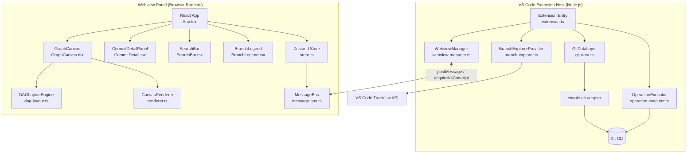
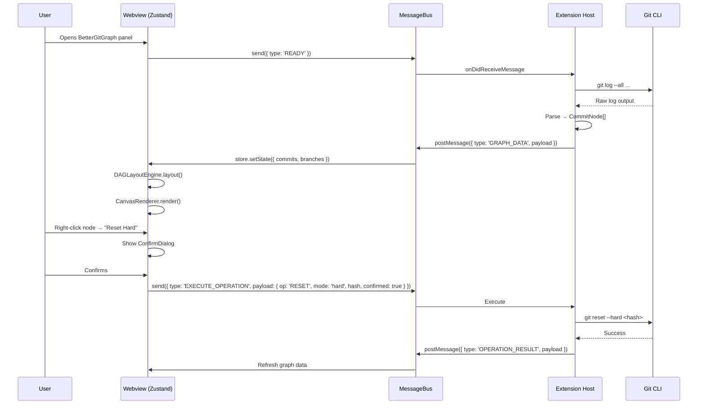

# BetterGitGraph — Technical Documentation

> **Version:** 1.0.0-draft  
> **Date:** 2026-08-24  
> **Companion:** [PRD](./PRD.md)  
> **Audience:** Developers, AI Agents, Contributors

---

## Table of Contents

1. [Architecture Overview](#1-architecture-overview)
2. [Tech Stack](#2-tech-stack)
3. [Directory Structure](#3-directory-structure)
4. [Context Protocol (Agent Collaboration)](#4-context-protocol-agent-collaboration)
5. [Core Subsystems](#5-core-subsystems)
   - 5.1 Git Data Layer
   - 5.2 DAG Layout Engine
   - 5.3 Canvas Renderer
   - 5.4 Webview ↔ Extension Bridge
   - 5.5 Operation Executor
   - 5.6 Branch Color Engine
   - 5.7 Branch Explorer Tree View
6. [Data Models](#6-data-models)
7. [State Management](#7-state-management)
8. [Coding Standards](#8-coding-standards)
9. [Testing Strategy](#9-testing-strategy)
10. [CI/CD Pipeline](#10-cicd-pipeline)
11. [Implementation Milestones](#11-implementation-milestones)

---

## 1. Architecture Overview



### Key Architectural Decisions

| Decision | Rationale |
|----------|-----------|
| **Webview panel** (not sidebar) | Full-screen canvas; sidebar too narrow for graph |
| **React + Canvas** (not SVG) | SVG degrades past ~500 nodes; canvas stays fast |
| **simple-git** (not raw child_process) | Type-safe, battle-tested git wrapper for Node.js |
| **Zustand** state store | Minimal boilerplate, works outside React tree for message bus sync |
| **postMessage bridge** | Required by VS Code security model for Webview ↔ host comms |
| **Sugiyama DAG layout** | Standard algorithm for layered directed graphs; readable for both git newcomers and power users |

---

## 2. Tech Stack

| Layer | Technology | Version | Reason |
|-------|-----------|---------|--------|
| Extension Host | **TypeScript** | ^5.4 | Type safety, VS Code API types |
| Extension Host | **Node.js** | ≥20 LTS | VS Code requirement |
| Extension Host | **simple-git** | ^3.26 | Git operations |
| Webview | **React** | ^19 | Component model, ecosystem |
| Webview | **TypeScript** | ^5.4 | Shared types with host |
| Webview | **Vite** | ^6 | Fast HMR for webview dev |
| Webview | **Zustand** | ^5 | Lightweight state management |
| Webview | **@dagrejs/dagre** | ^0.8 | Dagre layout (Sugiyama-based) |
| Webview | **Canvas API** | Native | Performant node/edge rendering |
| Styling | **CSS Modules + CSS Variables** | — | VS Code theme variable integration |
| Testing | **Vitest** | ^2 | Unit tests (fast, ESM-native) |
| Testing | **@vscode/test-electron** | ^2 | Extension integration tests |
| Testing | **Playwright** | ^1.45 | Webview E2E tests |
| Linting | **ESLint + @typescript-eslint** | ^8 | Code quality |
| Formatting | **Prettier** | ^3 | Consistent formatting |
| Bundling | **esbuild** (host) + **Vite** (webview) | — | Separate bundles for each runtime |
| Packaging | **@vscode/vsce** | ^3 | Marketplace publishing |

---

## 3. Directory Structure

```
bettergitgraph/
├── .github/
│   ├── workflows/
│   │   ├── ci.yml                    # Lint, test, build on every PR
│   │   └── release.yml               # Publish to Marketplace on tag
│   └── ISSUE_TEMPLATE/
│       ├── bug_report.md
│       └── feature_request.md
│
├── .agent/                           # ← Agent Collaboration Context (see §4)
│   ├── CONTEXT.md                    # Living document: current state, decisions, TODOs
│   ├── ARCHITECTURE.md               # Stable arch summary (mirrors §1 above)
│   ├── DECISIONS.md                  # ADR log (Architecture Decision Records)
│   └── TASKS.md                      # Current sprint tasks with status
│
├── docs/
│   ├── PRD.md                        # Product Requirements Document
│   ├── TECH_DOCS.md                  # This document
│   └── CONTRIBUTING.md               # Contributor guide
│
├── src/
│   ├── extension/                    # Extension Host code (Node.js)
│   │   ├── extension.ts              # Entry point — activate()
│   │   ├── git-data.ts               # GitDataLayer class
│   │   ├── operation-executor.ts     # GitOperationExecutor class
│   │   ├── branch-explorer.ts        # BranchExplorerProvider (TreeDataProvider)
│   │   ├── webview-manager.ts        # WebviewManager — panel lifecycle
│   │   ├── color-engine.ts           # BranchColorEngine
│   │   └── types/
│   │       └── index.ts              # Shared types (re-exported to webview via build)
│   │
│   └── webview/                      # Webview code (Browser)
│       ├── main.tsx                  # React entry
│       ├── App.tsx                   # Root component + layout
│       ├── store/
│       │   ├── store.ts              # Zustand store definition
│       │   └── message-bus.ts        # postMessage ↔ store sync
│       ├── components/
│       │   ├── GraphCanvas/
│       │   │   ├── GraphCanvas.tsx   # Canvas wrapper component
│       │   │   ├── renderer.ts       # CanvasRenderer class
│       │   │   └── dag-layout.ts     # DAGLayoutEngine class
│       │   ├── CommitDetail/
│       │   │   ├── CommitDetail.tsx
│       │   │   └── FileList.tsx
│       │   ├── SearchBar/
│       │   │   └── SearchBar.tsx
│       │   ├── BranchLegend/
│       │   │   └── BranchLegend.tsx
│       │   ├── ContextMenu/
│       │   │   └── ContextMenu.tsx   # Dynamic right-click menu
│       │   ├── ConfirmDialog/
│       │   │   └── ConfirmDialog.tsx # Destructive action confirmation
│       │   ├── BeginnerMode/
│       │   │   ├── WhatWillThisDo.tsx
│       │   │   ├── GlossaryTooltip.tsx
│       │   │   └── Walkthrough.tsx
│       │   └── OperationLog/
│       │       └── OperationLog.tsx
│       └── hooks/
│           ├── useGraph.ts           # Graph data selector
│           ├── useCanvas.ts          # Canvas ref + resize observer
│           └── useContextMenu.ts     # Context menu state
│
├── tests/
│   ├── unit/
│   │   ├── color-engine.test.ts
│   │   ├── dag-layout.test.ts
│   │   └── git-data.test.ts
│   ├── integration/
│   │   └── extension.test.ts         # @vscode/test-electron tests
│   └── e2e/
│       └── graph.spec.ts             # Playwright webview tests
│
├── scripts/
│   ├── build-host.ts                 # esbuild script for extension host
│   └── build-webview.ts              # Vite build script for webview
│
├── .vscode/
│   ├── launch.json                   # Debug configurations
│   ├── tasks.json                    # Build tasks
│   └── extensions.json               # Recommended extensions for contributors
│
├── package.json                      # Extension manifest + npm scripts
├── tsconfig.json                     # Base TS config
├── tsconfig.host.json                # Host-specific TS config
├── tsconfig.webview.json             # Webview-specific TS config
├── vite.config.ts                    # Webview Vite config
├── esbuild.config.ts                 # Host esbuild config
├── .eslintrc.json
├── .prettierrc
└── CHANGELOG.md
```

---

## 4. Context Protocol (Agent Collaboration)

> [!IMPORTANT]
> This section defines the **Agent Context Protocol** — a structured system for keeping AI agents oriented in this codebase across sessions. Every agent working on this repo **MUST** read `.agent/CONTEXT.md` before starting work and **MUST** update it after completing significant changes.

### 4.1 `.agent/` Directory

The `.agent/` directory is the **single source of truth** for AI agents.

#### `.agent/CONTEXT.md` — Living State Document

Updated after every significant agent session. Format:

```markdown
# BetterGitGraph Agent Context

## Last Updated
2026-08-24 by moreno_m5 / agent-session-<id>

## Current State
- Branch: main
- Last milestone completed: M0 — Project scaffold
- Next milestone: M1 — Git Data Layer

## What's Working
- [x] Project scaffold
- [ ] Git data layer

## Active Decisions
- Using dagre for layout (see DECISIONS.md #ADR-001)

## Known Issues / TODOs
- TODO: Benchmark dagre vs elkjs for large repos (>5k commits)

## Agent Instructions
When making changes, always:
1. Update this CONTEXT.md file at the end of your session
2. Add any new Architecture Decision Records to DECISIONS.md
3. Mark completed tasks in TASKS.md
4. Run `npm run test` before committing
```

#### `.agent/DECISIONS.md` — ADR Log

```markdown
# Architecture Decision Records

## ADR-001: Layout Engine — Dagre
**Date:** 2026-08-24
**Status:** Accepted
**Decision:** Use @dagrejs/dagre for DAG layout
**Reason:** Mature, well-tested, supports edge routing. Alternatives (elkjs, custom) considered.
**Consequences:** Layout is CPU-bound; large repos may need web worker offloading.
```

#### `.agent/TASKS.md` — Sprint Tracking

```markdown
# Task Tracker

## M1 — Git Data Layer
- [ ] Implement GitDataLayer.getCommitGraph()
- [ ] Implement GitDataLayer.getAllBranches()
- [ ] Implement GitDataLayer.fetchAll()
- [ ] Unit tests for GitDataLayer

## M2 — DAG Layout + Canvas Renderer
- [ ] DAGLayoutEngine.layout(graph)
- [ ] CanvasRenderer.render(layout)
- [ ] Zoom/pan interaction
- [ ] Node selection + highlight
```

### 4.2 Agent Onboarding Checklist

When an agent starts a session on this repo:

1. `cat .agent/CONTEXT.md` — understand current state
2. `cat .agent/TASKS.md` — find the next task
3. Read relevant source files (never assume they haven't changed)
4. Make changes
5. Run `npm run test`
6. Update `.agent/CONTEXT.md`, `.agent/DECISIONS.md`, `.agent/TASKS.md`
7. Commit with conventional commit message: `feat(git-data): implement getCommitGraph`

---

## 5. Core Subsystems

### 5.1 Git Data Layer (`src/extension/git-data.ts`)

**Responsibility:** Interface with the git CLI via `simple-git`. Returns typed data structures.

```typescript
export interface CommitNode {
  hash: string;        // Full 40-char SHA
  shortHash: string;   // First 8 chars
  message: string;
  author: string;
  authorEmail: string;
  date: Date;
  parents: string[];   // Parent hashes (2 for merge commits)
  refs: string[];      // Branch/tag names pointing here
}

export interface BranchInfo {
  name: string;
  isRemote: boolean;
  isHead: boolean;
  upstream?: string;
  aheadCount: number;
  behindCount: number;
  headHash: string;
}

export class GitDataLayer {
  constructor(private git: SimpleGit, private repoRoot: string) {}

  /** Returns ALL commits reachable from all refs, deduplicated */
  async getCommitGraph(options?: {
    maxCount?: number;   // default: 2000, virtualize beyond this
    since?: Date;
    authors?: string[];
  }): Promise<{ commits: CommitNode[]; edges: [string, string][] }>;

  /** Returns all local + remote branches with tracking info */
  async getAllBranches(): Promise<BranchInfo[]>;

  /** Returns all tags */
  async getTags(): Promise<TagInfo[]>;

  /** Returns stash list */
  async getStashes(): Promise<StashInfo[]>;

  /** git fetch --all --prune */
  async fetchAll(): Promise<FetchResult>;

  /** Files changed in a commit */
  async getCommitFiles(hash: string): Promise<ChangedFile[]>;

  /** Unified diff for a file at a commit */
  async getFileDiff(hash: string, filePath: string): Promise<string>;
}
```

**Key implementation detail:** `getCommitGraph` runs:
```
git log --all --topo-order --format="%H|%P|%s|%an|%ae|%aI|%D"
```
Then parses each line into `CommitNode` objects and derives edges from parent relationships.

---

### 5.2 DAG Layout Engine (`src/webview/components/GraphCanvas/dag-layout.ts`)

**Responsibility:** Given a commit graph, compute x/y positions for each node and edge path waypoints.

```typescript
export interface LayoutNode {
  hash: string;
  x: number;
  y: number;
  branchColor: string;
  isHead: boolean;
  isMerge: boolean;
  refs: string[];
}

export interface LayoutEdge {
  source: string;   // hash
  target: string;   // hash
  color: string;
  waypoints: { x: number; y: number }[];
}

export interface GraphLayout {
  nodes: LayoutNode[];
  edges: LayoutEdge[];
  width: number;
  height: number;
}

export class DAGLayoutEngine {
  private nodeSpacingX = 60;  // px between lanes
  private nodeSpacingY = 50;  // px between rows

  layout(
    commits: CommitNode[],
    branches: BranchInfo[],
    colors: Map<string, string>
  ): GraphLayout;
}
```

**Algorithm:**
1. Build a `dagre.graphlib.Graph` from commits + edges.
2. Set `rankdir: 'TB'` (top-to-bottom) or `'LR'` based on user setting.
3. Run `dagre.layout(g)` to get computed `x`, `y` per node.
4. Map dagre coordinates → pixel coordinates with scaling.
5. Compute edge waypoints from dagre's edge data (for bezier curves).

**Performance:** For repos >2000 commits, layout runs in a **Web Worker** to avoid blocking the main thread.

---

### 5.3 Canvas Renderer (`src/webview/components/GraphCanvas/renderer.ts`)

**Responsibility:** Draw the graph layout onto an HTML5 `<canvas>` element.

```typescript
export class CanvasRenderer {
  constructor(
    private canvas: HTMLCanvasElement,
    private ctx: CanvasRenderingContext2D
  ) {}

  render(layout: GraphLayout, viewport: Viewport): void;

  /** Only re-render nodes within the visible viewport (culling) */
  private cullNodes(nodes: LayoutNode[], viewport: Viewport): LayoutNode[];

  private drawEdge(edge: LayoutEdge): void;  // Bezier curve
  private drawNode(node: LayoutNode, isSelected: boolean): void;  // Circle
  private drawMergeNode(node: LayoutNode): void;  // Diamond
  private drawRefLabel(label: string, x: number, y: number, color: string): void;
  private drawHeadIndicator(node: LayoutNode): void;
}
```

**Viewport culling:** Nodes outside `viewport.x ± viewport.width` are not drawn, keeping render time flat regardless of repo size.

**Pan/Zoom:** Managed via CSS `transform: translate() scale()` on the canvas container for hardware acceleration. Canvas content itself is re-rendered only on zoom change (not during pan).

---

### 5.4 Webview ↔ Extension Bridge (`src/webview/store/message-bus.ts`)

**Responsibility:** Type-safe postMessage protocol between the VS Code extension host and the webview.

```typescript
// Shared type definitions (built into both bundles)
export type HostToWebviewMessage =
  | { type: 'GRAPH_DATA'; payload: { commits: CommitNode[]; branches: BranchInfo[] } }
  | { type: 'FETCH_COMPLETE'; payload: FetchResult }
  | { type: 'OPERATION_RESULT'; payload: OperationResult }
  | { type: 'THEME_CHANGE'; payload: { theme: 'light' | 'dark' | 'high-contrast' } };

export type WebviewToHostMessage =
  | { type: 'READY' }
  | { type: 'REQUEST_GRAPH'; payload?: { since?: string } }
  | { type: 'EXECUTE_OPERATION'; payload: GitOperation }
  | { type: 'REQUEST_DIFF'; payload: { hash: string; filePath: string } }
  | { type: 'FETCH_ALL' };

// In webview:
const vscode = acquireVsCodeApi();
const bus = new MessageBus(vscode);
bus.send({ type: 'READY' });
bus.on('GRAPH_DATA', (payload) => store.setState({ graph: payload }));

// In extension host:
panel.webview.onDidReceiveMessage((msg: WebviewToHostMessage) => { ... });
panel.webview.postMessage({ type: 'GRAPH_DATA', payload: ... });
```

---

### 5.5 Operation Executor (`src/extension/operation-executor.ts`)

**Responsibility:** Execute git operations requested from the webview. Validates, confirms (where needed), runs, and returns results.

```typescript
export type GitOperation =
  | { op: 'CHECKOUT'; hash?: string; branch?: string }
  | { op: 'RESET'; mode: 'soft' | 'mixed' | 'hard'; hash: string }
  | { op: 'REVERT'; hash: string }
  | { op: 'CHERRY_PICK'; hash: string }
  | { op: 'CREATE_BRANCH'; name: string; hash: string }
  | { op: 'DELETE_BRANCH'; name: string; force: boolean }
  | { op: 'MERGE'; branch: string; strategy?: 'ff' | 'no-ff' | 'squash' }
  | { op: 'REBASE'; branch: string }
  | { op: 'TAG'; name: string; hash: string; message?: string }
  | { op: 'PUSH'; branch: string; remote: string; force: boolean }
  | { op: 'PULL'; branch: string; remote: string };

export class GitOperationExecutor {
  async execute(op: GitOperation): Promise<OperationResult>;
  
  /** Records the operation in the undo log */
  private logOperation(op: GitOperation, result: OperationResult): void;
  
  /** Attempts to undo the last operation */
  async undoLast(): Promise<OperationResult>;
}
```

**Safety rules:**
- `RESET --hard` and `DELETE_BRANCH --force` require an explicit `confirmed: true` flag in the payload (set by the frontend after user confirms).
- `PUSH --force` is disabled in v1.0.
- All operations are logged to `.git/bettergitgraph-op-log.json`.

---

### 5.6 Branch Color Engine (`src/extension/color-engine.ts`)

**Responsibility:** Deterministically assign a color to each branch name.

```typescript
export class BranchColorEngine {
  private overrides: Map<string, string>;  // from .vscode/bettergitgraph.json

  /**
   * Deterministic color from branch name.
   * Algorithm:
   *   hash = fnv1a(branchName)  // fast non-crypto hash
   *   hue = hash % 360
   *   saturation = 70% (fixed, theme-adjusted)
   *   lightness = 55% dark theme / 40% light theme
   *   return hsl(hue, sat, light)
   */
  getColor(branchName: string, theme: 'dark' | 'light'): string;

  setOverride(branchName: string, color: string): void;
  removeOverride(branchName: string): void;
}
```

**FNV-1a** is chosen over SHA-256 because:
- Zero dependencies (implement in ~10 lines)
- Extremely fast (no crypto overhead)
- Good distribution across the hue space for branch names

---

### 5.7 Branch Explorer Tree View (`src/extension/branch-explorer.ts`)

**Responsibility:** Populate the VS Code Activity Bar tree view with a structured ref tree.

```
BRANCHES
├── LOCAL
│   ├── ● main (HEAD)          [↑2 ↓0]
│   ├── ○ feature/auth         [↑0 ↓3]
│   └── ○ bugfix/login-crash
├── REMOTES
│   └── origin
│       ├── feature
│       │   ├── auth
│       │   └── payments
│       └── main
├── TAGS
│   ├── v1.0.0
│   └── v0.9.1
└── STASHES
    └── stash@{0}: WIP on main: fix typo
```

Remote refs are parsed from `git ls-remote` output and structured as a file tree by splitting on `/`.

---

## 6. Data Models

```typescript
// CommitNode — core unit of the graph
interface CommitNode {
  hash: string;
  shortHash: string;
  message: string;
  author: string;
  authorEmail: string;
  date: Date;
  parents: string[];     // [] = root, [x] = normal, [x,y] = merge
  refs: string[];        // "HEAD -> main", "origin/main", "v1.0.0"
}

// BranchInfo — branch metadata with tracking
interface BranchInfo {
  name: string;
  isRemote: boolean;
  isHead: boolean;
  upstream?: string;
  aheadCount: number;
  behindCount: number;
  headHash: string;
}

// GraphLayout — output of layout engine
interface GraphLayout {
  nodes: LayoutNode[];
  edges: LayoutEdge[];
  width: number;
  height: number;
}

// AppState — Zustand store shape
interface AppState {
  commits: CommitNode[];
  branches: BranchInfo[];
  layout: GraphLayout | null;
  selectedHash: string | null;
  hoveredHash: string | null;
  searchQuery: string;
  filters: { authors: string[]; since?: Date; until?: Date; branches: string[] };
  beginnerMode: boolean;
  pendingOperation: GitOperation | null;
  operationLog: OperationLogEntry[];
  viewport: Viewport;
  theme: 'light' | 'dark' | 'high-contrast';
}
```

---

## 7. State Management



---

## 8. Coding Standards

### General
- **TypeScript strict mode** everywhere (`"strict": true`).
- **No `any`** — use `unknown` + type guards.
- **Conventional Commits** format: `feat|fix|docs|refactor|test|chore(scope): message`.
- **File naming**: `kebab-case.ts` for all source files.
- **Export barrel**: each directory has an `index.ts` re-exporting its public API.

### Extension Host
- Never import webview-only packages (e.g., React) — separate tsconfig enforces this.
- All git operations wrapped in try/catch; errors surface to webview via `OPERATION_RESULT { success: false, error: string }`.

### Webview
- React components: functional only, no class components.
- Canvas rendering: never in React render cycle — use `useEffect` + `useRef`.
- All user-facing strings go through a `t()` i18n function (even if only English in v1.0).

### Agent Protocol Addendum
- After any architectural change, update `.agent/DECISIONS.md` with an ADR.
- `.agent/CONTEXT.md` is updated at the **end of every agent session**.
- Never commit with `"WIP"` in the message — agents should produce clean, atomic commits.

---

## 9. Testing Strategy

### 9.1 Unit Tests (`tests/unit/`)

| File | What's Tested |
|------|--------------|
| `color-engine.test.ts` | Determinism: same branch name → same color across 1000 calls |
| `dag-layout.test.ts` | Layout of linear chain, fork, merge, octopus merge |
| `git-data.test.ts` | Log parsing with mocked `simple-git` output |

Run: `npm run test:unit`

### 9.2 Integration Tests (`tests/integration/`)

Uses `@vscode/test-electron` to spin up a real VS Code instance with a fixture git repo.

- Extension activates correctly.
- `getCommitGraph` returns expected nodes for fixture repo.
- `execute({ op: 'CREATE_BRANCH', ... })` creates branch in fixture repo.

Run: `npm run test:integration`

### 9.3 E2E Tests (`tests/e2e/`)

Uses Playwright to control the VS Code webview.

- Graph renders at least 1 node for a repo with commits.
- Right-click on node shows context menu.
- Search filters highlight matching nodes.
- Confirm dialog appears before hard reset.

Run: `npm run test:e2e`

---

## 10. CI/CD Pipeline

```yaml
# .github/workflows/ci.yml (abbreviated)
on: [push, pull_request]
jobs:
  ci:
    runs-on: ubuntu-latest
    steps:
      - uses: actions/checkout@v4
      - uses: actions/setup-node@v4
        with: { node-version: '20' }
      - run: npm ci
      - run: npm run lint
      - run: npm run build
      - run: npm run test:unit
      - run: npm run test:integration   # needs Xvfb on Linux
      - run: npm run test:e2e

# .github/workflows/release.yml
on:
  push:
    tags: ['v*']
jobs:
  publish:
    steps:
      - run: npm run build
      - run: npx vsce publish --no-dependencies
        env:
          VSCE_PAT: ${{ secrets.VSCE_PAT }}
```

---

## 11. Implementation Milestones

| Milestone | Deliverables | Est. Effort |
|-----------|-------------|-------------|
| **M0 — Scaffold** | Repo init, tsconfigs, esbuild+vite config, CI pipeline, `.agent/` setup | 1 day |
| **M1 — Git Data Layer** | `GitDataLayer` + unit tests + simple-git integration | 2 days |
| **M2 — Layout + Renderer** | `DAGLayoutEngine` + `CanvasRenderer` + zoom/pan + viewport culling | 3 days |
| **M3 — Webview Shell** | React app, Zustand store, MessageBus, basic graph rendering end-to-end | 2 days |
| **M4 — Branch Explorer** | TreeDataProvider, remote file tree, ahead/behind counts | 1 day |
| **M5 — Operations** | Context menu, `OperationExecutor`, confirm dialogs, operation log | 2 days |
| **M6 — Beginner Mode** | Walkthrough, glossary tooltips, "What will this do?" panel | 2 days |
| **M7 — Search & Filter** | Search bar, author/date/branch filters | 1 day |
| **M8 — Diff View** | Commit detail panel, file list, VS Code diff editor integration | 1 day |
| **M9 — Polish & QA** | E2E tests, performance benchmarking, accessibility audit, README | 2 days |
| **M10 — Release** | Marketplace listing, screenshots, changelog | 1 day |
| **Total** | | **~18 days** |

---

## Appendix A: `package.json` Manifest (Key Fields)

```jsonc
{
  "name": "bettergitgraph",
  "displayName": "BetterGitGraph",
  "description": "Beautiful, interactive git graph for VS Code — built for everyone.",
  "version": "1.0.0",
  "engines": { "vscode": "^1.90.0" },
  "categories": ["SCM Providers", "Visualization"],
  "activationEvents": ["workspaceContains:.git"],
  "main": "./dist/extension.js",
  "contributes": {
    "commands": [
      { "command": "bettergitgraph.open", "title": "BetterGitGraph: Open Graph" },
      { "command": "bettergitgraph.fetchAll", "title": "BetterGitGraph: Fetch All" }
    ],
    "keybindings": [
      { "command": "bettergitgraph.open", "key": "ctrl+shift+g g", "mac": "cmd+shift+g g" }
    ],
    "views": {
      "scm": [
        { "id": "bettergitgraph.branchExplorer", "name": "Branch Explorer" }
      ]
    },
    "configuration": {
      "title": "BetterGitGraph",
      "properties": {
        "bettergitgraph.layoutDirection": { "type": "string", "enum": ["TB", "LR"], "default": "TB" },
        "bettergitgraph.beginnerMode": { "type": "boolean", "default": true },
        "bettergitgraph.maxCommits": { "type": "number", "default": 2000 }
      }
    }
  }
}
```
